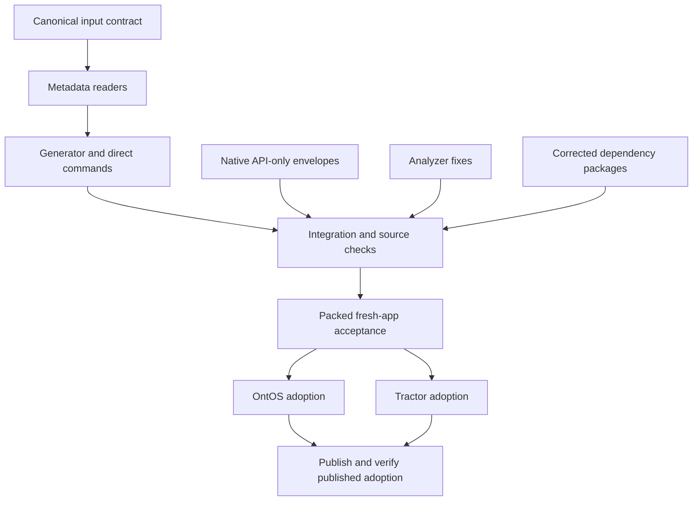

# UltraModern consumer maintenance cuts

This is an implementation plan and a validated orchestration handoff. No implementation has started. Read this document, the assigned lane, and the repository's AGENTS.md before writing code.

The intended result is an ordinary application dependency update. OntOS and generated applications must not carry a second framework release manifest, a serialized copy of framework defaults, patches against our own packages, or pass-through launch scripts. Preserve application behavior and actual security, ownership, dependency and delivery-unit invariants.

## Accepted cuts

| Current maintenance burden | Required result |
| --- | --- |
| Consumer `.modernjs/release-cohort.json` | Deleted. Installed framework packages own release expectations; package manifests and the lockfile own consumer dependency selection. |
| Consumer `.modernjs/ultramodern.json` | Deleted completely. Keep each real app choice in an existing authoritative configuration source. No replacement mega-file, package.json mega-object, split registries or old-format reader. |
| Three OntOS patches against UltraModern packages | Deleted after their required behavior is implemented natively. The synthetic API-only proof envelope is replaced with a real emitted envelope, not moved intact. |
| Framework-required MF, CSP and generated-database patches | Corrections arrive through actual published dependencies. Applications need no patch installation or root overrides to activate them. |
| Repeated framework pins and release-age exception lists | Native dependency catalogs centralize consumer pins. Fresh-release acceptance uses exact command-scoped exceptions; normal installs retain package-manager trust/age policy. |
| Generated framework command wrappers and wrapper registries | Deleted where they only forward to the installed CLI. App-specific orchestration survives when it performs real app work. |
| Obsolete format/migration scaffolding and representation-only tests | Deleted with the old contract. Keep focused behavioral tests and existing downstream acceptance. |

No backwards compatibility, dual writes, silent fallbacks, alias APIs, shims, monkeypatches, postinstall edits, new migration framework, runtime facade or replacement governance system. This does not authorize removing DB migrations, Module Federation interoperability, supported runtime environments or legitimate app configuration.

## Evidence and scope

Planning base: Modern.js `a0ae288f342aa1394a87298cda398eb63b19855a`; OntOS `e1690997ba67ba2e19ee0efc3cf2b51e6c65ea62` in [PR #886](https://github.com/TechsioCZ/ontos/pull/886). Recheck actual branch heads and PR state at execution; do not copy stale worktrees or assume a PR remains unmerged.

OntOS's files contain 292 and 1,330 lines respectively. Removing both cuts 1,622 copied metadata lines from that consumer, but this is a file-deletion baseline, not a promised total net reduction. The framework and all consumer diffs must still be measured honestly.

Relevant verified source:

- `packages/toolkit/ultramodern-create/src/ultramodern-tooling/config/load.ts` unconditionally loads the compact file; `normalize.ts` and `types.ts` define its normalized contract.
- `src/ultramodern-release-cohort.ts` reads and copies the consumer cohort; `src/ultramodern-workspace/cohort-parity.ts` and `validation/workspace.ts` demand the copied projection.
- `src/ultramodern-workspace/{write-workspace,workspace-validation-contract,package-json,delivery-unit-sync,add-shell}.ts` and `add-vertical/**` write or depend on this metadata.
- `src/ultramodern-workspace/{patch-inventory,policy,patch-parity,tooling-command-catalog,workspace-script-plan}.ts` define the consumer patch/command obligations.
- `packages/solutions/app-tools-extensions/src/release-envelope/**` owns emitted envelope behavior. `templates/workspace-scripts/proof-node-backend-federation.mjs` currently needs the consumer's synthetic API-only workaround.
- `packages/toolkit/code-tools/src/{microvertical-api-baseline,strict-effect-runtime}.ts` and `oxlint-plugin/rules/strict-effect-api-boundaries.ts` own the analyzer defects. Both code-tools and these files are fork-added against audited base `eded841256`; so are app-tools-extensions and ultramodern-create.
- `scripts/ultramodern-publish/lib/prepare-bleedingdev-packages/sidecars.mjs` already stages corrected image dependencies. Extend this mechanism for necessary corrected dependencies; preserve its peer/bin/export constraints.
- `CONTEXT.md` and `docs/super-app-rfc-adr/ADR-0019-federated-loading-unified-delivery.md` define delivery identity. The plan removes duplicate configuration, not unified-delivery checks.

No `docs/adr/` or `docs/agents/domain.md` exists at the inspected base. The applicable actual ADR above was read. Historical plans elsewhere under `.codex/plans` are excluded, including prior migration, release-streamline and fork-cuts plan sets. Do not launch those as additional work.

## Configuration destinations

These are the agreed destinations, not a new runtime translation registry. `cc-contract` must trace every leaf and concrete nondefault setting before removing its existing storage.

| Old key | Final authority or disposition |
| --- | --- |
| `schemaVersion`, `profile` | Existing topology schema where needed; retire the compact format/profile discriminator. Preserve feature selection as actual plugin options, not a frozen profile copy. |
| `generator` | Installed package identity; remove the application version stamp. |
| `workspace` | Existing package names, `packageManager`, engines, mise settings and workspace membership. Resolve conflicts rather than inventing another authority. |
| `packageSource` | Native manifest/catalog and package-manager registry configuration; local generation flags are invocation state. |
| `features` | Existing plugin/build options or meaningful logical topology choices. Defaults stay in the framework. |
| `topology` | Existing reference topology and ownership records for logical composition; package manifests for package identity. |
| `bridge` | Existing bridge plugin/options and package relationships; preserve singleton, lock and boundary checks against actual resolved inputs. |
| `deploy` | Native app build/deployment options and emitted platform configuration. Preserve nondefault security/CSP choices. |
| `moduleFederation` | Actual native MF configuration and logical composition topology, without copied resolved defaults. |
| `backendFederation` | Logical declared capabilities, actual backend/MF configuration and emitted manifests. Preserve bound identity and authentication. |
| `agentSkills` | Installed CLI defaults plus existing skill lockfile/app scripts where there is a real app choice. |
| `tooling` | Installed CLI command definitions and native package scripts; remove generated wrapper metadata. |

## Behavior that must survive

| Claim | Evidence required before release |
| --- | --- |
| Fresh and existing workspaces work without the retired files | Generate shell/UI/API-only apps and validate real OntOS/Tractor from packed packages, with the files absent. |
| App-specific choices survive | Nondefault bridge, security/CSP, ports, topology, multiple-shell and deployment options retain the same effective behavior. |
| API-only is a native supported delivery unit | Real Node/Cloudflare artifact envelopes contain the emitted surfaces; no fabricated proof envelope or skipped identity validation. |
| Identity/security failures still reject | Wrong revision, changed hash, missing declared artifact, incompatible dependency and forbidden private imports fail in focused negative controls. |
| Router, localization, SSR, federation and BFF remain usable | Existing consumer runtime/UI tests, Node federation proof, Cloudflare/workerd proof and complete downstream suites pass. |
| Analyzer corrections remain strict | Large valid APIs and legitimate shared exports pass; overflow, legacy forbidden imports and cross-owner private imports still fail. |
| Published dependencies carry every required fix | Clean installs without framework-required consumer patches resolve the corrected transitive closure and preserve runtime/type singletons. |
| Cross-platform CLI/build behavior survives | Existing Windows/ESM/native compiler paths-with-spaces acceptance passes; direct scripts forward status and signals correctly. |

Reuse existing tests. Remove tests whose sole assertion is the old file shape. Do not create large mirrored suites or another acceptance harness. Use real packed-package failures and nearby negative controls where the owning behavior changes.

## Graph and launch waves



Resolved Codex limits: `max_threads=50`, `max_depth=3`, from `/Users/satan/.codex/config.toml`. The plan deliberately uses at most four active implementation owners including root. Spare capacity is not a reason to split shared source files across more writers. No nested spawning is planned. Re-read live limits and existing agents before execution.

| Wave | Root work | Delegated work | Join/stop condition |
| --- | --- | --- | --- |
| 0 | `cc-contract`, canonical source and interface freeze | Start `cc-runtime`, `cc-analyzer`, `cc-dependencies` immediately | Contract unlocks metadata readers; independent workers keep running. |
| 1 | `cc-metadata`, then `cc-generator` | Continue the same three independent workers | All four branches finish focused tests and handoffs. |
| 2 | `cc-integration` | Optional read-only reviewer of a finished patch, no concurrent shared writes | Clean coherent source candidate and canonical boundary gate. |
| 3 | `cc-package-proof` | Independent platform verification only when existing runners/worktrees isolate outputs | One immutable packed candidate passes fresh-app acceptance. |
| 4 | Maintain exact candidate and integrate findings | `cc-ontos` and `cc-tractor`, one owner per repo | Both real downstreams pass that candidate. |
| 5 | `cc-release` and final cut report | Reuse the two consumer owners for published adoption checks | Verified publication, required consumer checks, successful pushes. |

Likely critical path: contract -> metadata -> generator -> integration -> packed proof -> slower downstream -> published acceptance. The corrected-dependency branch can become critical if the required dependency closure or peer resolution needs additional fixes. Do not start integration before either branch finishes.

## Ownership and handoff rules

Each lane file gives its exact scope, do-not-edit boundary, acceptance and stop condition. The central conflict map is:

| Hotspot | Sole writer and sequencing |
| --- | --- |
| Config input types | `cc-contract` initially, then explicit handoff to `cc-metadata`. |
| Workspace validation contract | `cc-metadata` reader changes first; `cc-generator` producer changes only after that lane completes. |
| Envelope types and verification | `cc-runtime`; integration consumes its final contract. |
| Node proof template | `cc-integration` only, after runtime and metadata contracts settle. |
| Package manifests, pnpm files, policy.ts, patch-inventory.ts, changesets, fork ledger | Root in `cc-integration`; other lanes provide exact proposed changes. |
| Sidecar code and publication helpers | `cc-dependencies`; central package/policy rewiring remains root-owned. |
| OntOS and Tractor files | Separate consumer owners in separate worktrees; no source-framework repairs there. |

Before each native `spawn_agent`, send: the exact lane path, README, graph handoff, Beads id, candidate/base identity, assigned worktree, write allowlist, verification and stop condition. Include: "You are not alone in the codebase. Do not revert others' edits. Do not broaden scope or spawn agents. Hand cross-owner edits back to root." Default to the available native Codex model. Do not launch Claude Code or another agent CLI.

A worker returns changed paths, behavior/deletions, tests with results, unresolved blockers, and any exact cross-owner patch needed. Root checks scope and evidence before releasing successor lanes. One overlap triggers a narrowed handoff; a second overlap serializes that area. Tooling/runtime defects go back to their owner rather than becoming consumer workarounds.

## Exact graph targeting

The canonical selection is the complete command below. The machine plans are exactly `cc-*.plan.md` in this directory. README.md is the non-runnable handoff document, excluded from the graph. No selected plan is a documentation-only wrapper.

- Graph id: `consumer-cuts-20260922`
- Selection hash: `456e041cbb`
- State root argument: `.codex/plan-graphs`
- Resolved state directory: `.codex/plan-graphs/consumer-cuts-20260922`
- Snapshot: `.codex/plan-graphs/consumer-cuts-20260922/snapshot.json`
- DAG JSON/Mermaid and frontier JSON are persisted beside that snapshot.

The hash includes absolute plan paths and edges. In another checkout, keep the explicit graph id, rerun the exact selection there, and record its new resolved hash; never pretend the old hash identifies different absolute paths.

Run from the Modern.js root, using the installed skill CLI. Change `validate` to `dag --format mermaid`, `summary --format json`, or `frontier --format json --lanes 4 --max-depth 2` while retaining all selection arguments:

```sh
python3 /Users/satan/workspace/bleedingdev/resources/skills/code/skills/plan-graph/scripts/plan_graph.py validate \
  --plans-root .codex/plans/consumer-cuts-20260922 --glob 'cc-*.plan.md' \
  --graph-id consumer-cuts-20260922 --state-dir .codex/plan-graphs --write-state --strict \
  --depends cc-contract:cc-metadata \
  --depends cc-metadata:cc-generator \
  --depends cc-generator:cc-integration --depends cc-runtime:cc-integration \
  --depends cc-analyzer:cc-integration --depends cc-dependencies:cc-integration \
  --depends cc-integration:cc-package-proof \
  --depends cc-package-proof:cc-ontos --depends cc-package-proof:cc-tractor \
  --depends cc-ontos:cc-release --depends cc-tractor:cc-release
```

The current ready frontier is `cc-contract`, `cc-runtime`, `cc-analyzer`, and `cc-dependencies`. Implementation tasks are all pending. Validating the graph does not complete them or launch workers.

## Tracking and completion

Beads is the execution tracker. The mapping below connects every lane to its task under execution epic `modernjs-h7or2`; plan statuses are the required graph projection. Claim/close the Beads task and update its plan status together. Do not maintain a second Markdown checkbox list. The planning task is `modernjs-wn5fr` and closes once these artifacts validate and are pushed; execution tasks remain open.

At execution, append only live lane/agent/owner/blocker/status/next-action facts to `.codex/plan-graphs/consumer-cuts-20260922/operator-log.md`. Do not turn it into a narrative report. Keep graph snapshots as local saved state; the selected plans and explicit edges are the portable source of truth.

Final acceptance requires the deletions and behavior evidence above, zero replacement compatibility machinery, real downstream publication acceptance, and honest first-party/generated/vendor diff accounting. Feature preservation outranks a cosmetic line-count target. If unavoidable new first-party code outweighs the removed scaffolding, explain and review that result instead of calling it simplification. Preserve unrelated user work and only commit task-owned records and files.

| Plan | Beads task |
| --- | --- |
| [cc-analyzer](cc-analyzer.plan.md) | `modernjs-h7or2.1` |
| [cc-contract](cc-contract.plan.md) | `modernjs-h7or2.2` |
| [cc-dependencies](cc-dependencies.plan.md) | `modernjs-h7or2.3` |
| [cc-generator](cc-generator.plan.md) | `modernjs-h7or2.4` |
| [cc-integration](cc-integration.plan.md) | `modernjs-h7or2.5` |
| [cc-metadata](cc-metadata.plan.md) | `modernjs-h7or2.6` |
| [cc-ontos](cc-ontos.plan.md) | `modernjs-h7or2.7` |
| [cc-package-proof](cc-package-proof.plan.md) | `modernjs-h7or2.8` |
| [cc-release](cc-release.plan.md) | `modernjs-h7or2.9` |
| [cc-runtime](cc-runtime.plan.md) | `modernjs-h7or2.10` |
| [cc-tractor](cc-tractor.plan.md) | `modernjs-h7or2.11` |
