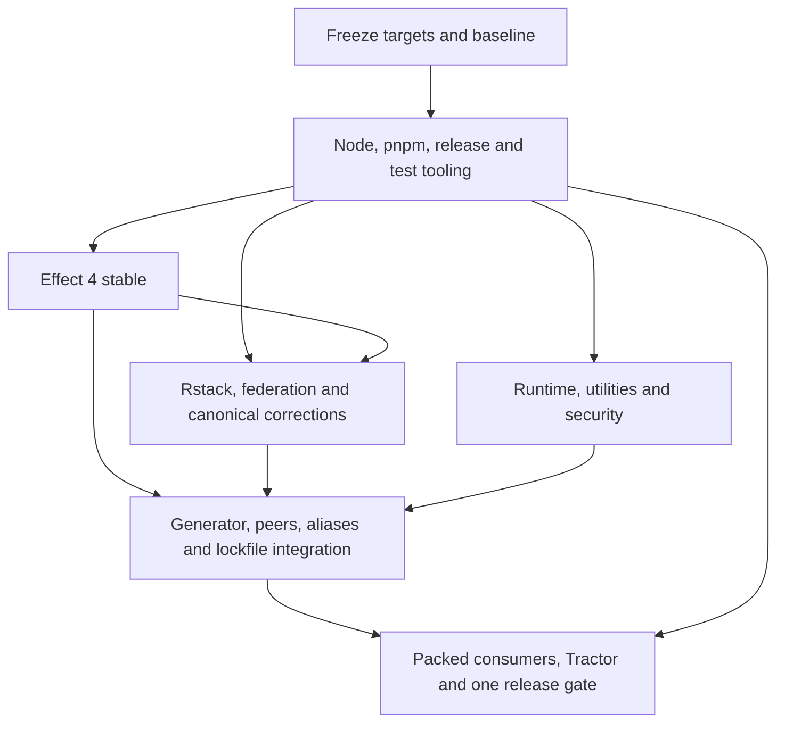

# One-release dependency refresh plan

This is a research-backed plan, not an executed upgrade. All implementation work is pending under Beads epic `modernjs-h8xqq`. [Research and full inventories](../../../docs/research/dependency-refresh-20261001/research.md) cover tracked manifests, generator policies, correction recipes and the complete resolved lockfile.

Seven plans sequence internal work into one public release. Beads owns progress and blocking relationships. Frontmatter status is the graph projection.



The build/supply owner applies canonical correction changes after receiving Effect's retirement proof. Every lane supplies manifest proposals to one integration coordinator. Only that coordinator edits shared manifests/YAML/lockfile or runs installs. Independent source lanes may be delegated only after the graph is valid and delegation is authorized; this planning task launches none.

## Ownership and Beads

| Plan | Beads | Main ownership |
| --- | --- | --- |
| dr-baseline | modernjs-h8xqq.1 | Target matrix, ownership routes, baseline evidence |
| dr-tooling | modernjs-h8xqq.2 | Root tooling, release scripts, test-only examples |
| dr-effect | modernjs-h8xqq.3 | Effect runtime and CLI extension integration |
| dr-build | modernjs-h8xqq.4 | Compiler/federation, Rstest adapter, canonical supply files |
| dr-runtime | modernjs-h8xqq.5 | Other runtime libraries, utilities, docs, security proposals |
| dr-generator | modernjs-h8xqq.6 | Generator source/projections and serialized dependency graph integration |
| dr-release | modernjs-h8xqq.7 | Integrated proof, packed consumers, downstream acceptance and release evidence |

## Validate and inspect

Use the actual installed plan-graph script path if the skill moves. Always pass the complete selection and every explicit edge. Without the edges, these files would be incorrectly treated as independent roots.

```sh
python3 /Users/satan/.codex/skills/plan-graph/scripts/plan_graph.py validate \
  --plans-root .codex/plans/dependency-refresh-20261001 \
  --glob '*.plan.md' \
  --depends dr-baseline:dr-tooling \
  --depends dr-tooling:dr-effect \
  --depends dr-tooling:dr-build \
  --depends dr-tooling:dr-runtime \
  --depends dr-effect:dr-build \
  --depends dr-effect:dr-generator \
  --depends dr-build:dr-generator \
  --depends dr-runtime:dr-generator \
  --depends dr-generator:dr-release \
  --depends dr-tooling:dr-release
```

Run the identical selection and edges with `dag --format mermaid` to inspect the graph and `frontier --lanes 3 --max-depth 2` for executable work. Validation and the initial frontier are recorded in `validation.txt`; no work is marked completed merely because it has been planned.

## Release contract

Freeze targets once, qualify internal commits and candidate packs, then promote the complete framework version once. Do not publish intermediate framework versions. Preserve the platform's current behavior and fix regressions in the owning layer. Active stable dependencies move forward; prerelease-only requirements and incompatible peer cohorts receive explicit dispositions. Publication authorization is separate from this research/planning request.
