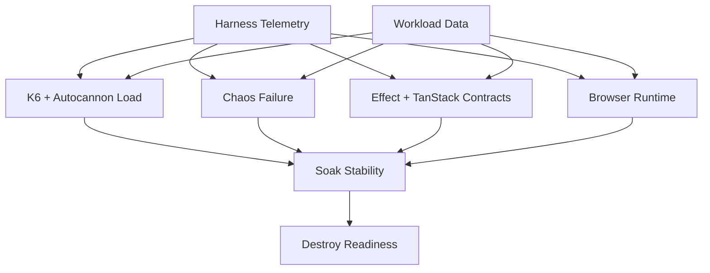

# UltraModern SuperApp Torture Wave 1 Launch

Date: 2026-05-01
Graph: `ultramodern-superapp-torture-v1`
Selection hash: `83efa5ca56`
Issue: `modernjs-xuy`

## Agent Limits

- `max_threads`: 50
- `max_depth`: 3

The first wave intentionally uses only one worker plus the primary agent. The
two root lanes are broad enough to matter, but still have clean ownership
boundaries.

## Launch Waves

Wave 1, launched:

- `ultramodern-superapp-torture-harness-telemetry`
  - Owner: primary agent
  - Mode: write-capable
  - Scope: shared harness reports, `scripts/superapp-*`, plan status updates,
    graph snapshot, operator log
  - Current progress: `ust-harness-01..05` completed
- `ultramodern-superapp-torture-workload-data`
  - Owner: worker `019de282-19b0-7643-951f-97bcaa57110e` (`Banach`)
  - Mode: write-capable
  - Scope: `tests/integration/superapp-portfolio/**`
  - Current progress: `ust-data-01` completed; `ust-data-02` remains pending

Wave 2, blocked on Wave 1 completion:

- `ultramodern-superapp-torture-k6-load`
- `ultramodern-superapp-torture-chaos-failure`
- `ultramodern-superapp-torture-effect-tanstack-contracts`
- `ultramodern-superapp-torture-browser-runtime`

Wave 3, blocked on Wave 2 completion:

- `ultramodern-superapp-torture-soak-stability`
- `ultramodern-superapp-torture-destroy-readiness`

## Dependency Shape

## Ownership Boundaries

Primary local owner:

- `.codex/plans/ultramodern-superapp-torture-*.plan.md`
- `.codex/plan-graphs/ultramodern-superapp-torture-v1/snapshot.json`
- `.codex/plan-graphs/ultramodern-superapp-torture-v1/operator-log.md`
- `.codex/reports/*superapp*torture*`
- `scripts/superapp-certification/**`
- `scripts/superapp-load/**`

Worker owner:

- `tests/integration/superapp-portfolio/**`

Explicitly shared later, but single-owner during Wave 1:

- scenario identifiers
- artifact envelope fields
- certification profile names
- load scenario names

## Conflict Hotspots

- `scripts/superapp-certification/run-superapp-certification.js`
  - High risk because every downstream lane eventually wants profile wiring.
  - Wave 1 owner: primary only.
- `scripts/superapp-load/run-superapp-load.js`
  - High risk because k6/load and workload scenarios both touch scenario names.
  - Wave 1 owner: primary only; worker may only define fixture-local catalog.
- `tests/integration/superapp-portfolio/shared/portfolio-state.ts`
  - High risk for workload identity and scenario ids.
  - Wave 1 owner: worker only.
- `.codex/plan-graphs/ultramodern-superapp-torture-v1/snapshot.json`
  - Generated file; local owner only.
- `pnpm-lock.yaml`
  - Do not edit manually.

## First Wave Status

Completed locally:

- Harness inventory report:
  `.codex/reports/ultramodern-superapp-torture-harness-inventory-20260501.md`
- Production server controller:
  `scripts/superapp-certification/production-server-controller.js`
- Artifact envelope helper:
  `scripts/superapp-certification/artifact-schema.js`
- Harness contract artifact gate:
  `scripts/superapp-certification/validate-harness-contract.js`
- Workload domain catalog:
  `tests/integration/superapp-portfolio/shared/workload-domain-catalog.ts`

Still in flight:

- Workload-data `ust-data-02..05`
- Wave 2 lanes remain blocked until the workload-data root plan completes
