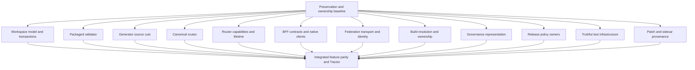

# Fork cuts execution handoff

[Read the audit](fork-simplification-20260922.md) for evidence, ranked cuts, rejected deletions and current behavior gates. This handoff contains proposed implementation, not completed changes.

## Exact selection

- Audit issue: `modernjs-b1ku4`.
- Implementation epic: `modernjs-wuutt`.
- Conditional replacement research, excluded from this graph: `modernjs-wuutt.15`.
- Plans: `.codex/plans/fork-cuts-20260922/*.plan.md`, exactly 14 files and 48 pending tasks.
- Explicit inter-plan edges: 24. Sequential tasks within each plan also form edges.
- Graph ID: `00-baseline-plus-13-plans-edcbd4c1f8`.
- Selection hash: `edcbd4c1f8`.
- Plan-set hash at authoring: `4599366b79`.
- Snapshot: `/Users/satan/workspace/bleedingdev/projects/modernjs/code/modernjs/.codex/plan-graphs/00-baseline-plus-13-plans-edcbd4c1f8/snapshot.json`.
- State directory: `/Users/satan/workspace/bleedingdev/projects/modernjs/code/modernjs/.codex/plan-graphs/00-baseline-plus-13-plans-edcbd4c1f8`.
- Machine-readable paths, edges and Beads mapping: [selection JSON](fork-simplification-20260922-selection.json).

Strict validation returned zero errors and zero warnings. The full CLI-generated Mermaid graph is [saved alongside this handoff](fork-simplification-20260922.mmd). The ignored snapshot stays local; the committed exact selection and plans reproduce it in another checkout. Its roots, 12 parallel implementation branches and final join were checked against the JSON frontier. Only the first preservation-baseline task is initially runnable. There is no independently runnable umbrella/documentation plan.

The longest dependency paths contain 11 sequential tasks: three baseline tasks, four tasks in a longer implementation lane, then four integration tasks. This is task depth, not a duration estimate. Shared contract and package-export decisions belong to the baseline/root integrator. Parallelism does not authorize competing changes to those files.

## Plan ownership and tracking

| Plan | Beads | Purpose |
| --- | --- | --- |
| [00-baseline.plan.md](../../.codex/plans/fork-cuts-20260922/00-baseline.plan.md) | `modernjs-wuutt.1` | preservation baseline |
| [10-workspace.plan.md](../../.codex/plans/fork-cuts-20260922/10-workspace.plan.md) | `modernjs-wuutt.2` | workspace model transactions |
| [11-validator.plan.md](../../.codex/plans/fork-cuts-20260922/11-validator.plan.md) | `modernjs-wuutt.3` | packaged validator |
| [12-generator-source.plan.md](../../.codex/plans/fork-cuts-20260922/12-generator-source.plan.md) | `modernjs-wuutt.4` | generator source cuts |
| [20-routes.plan.md](../../.codex/plans/fork-cuts-20260922/20-routes.plan.md) | `modernjs-wuutt.5` | canonical route model |
| [21-router-state.plan.md](../../.codex/plans/fork-cuts-20260922/21-router-state.plan.md) | `modernjs-wuutt.6` | router capabilities lifetime |
| [30-bff.plan.md](../../.codex/plans/fork-cuts-20260922/30-bff.plan.md) | `modernjs-wuutt.7` | bff contracts clients |
| [40-federation.plan.md](../../.codex/plans/fork-cuts-20260922/40-federation.plan.md) | `modernjs-wuutt.8` | federation contracts transport |
| [50-build.plan.md](../../.codex/plans/fork-cuts-20260922/50-build.plan.md) | `modernjs-wuutt.9` | build resolution ownership |
| [60-governance.plan.md](../../.codex/plans/fork-cuts-20260922/60-governance.plan.md) | `modernjs-wuutt.10` | governance representation |
| [61-release.plan.md](../../.codex/plans/fork-cuts-20260922/61-release.plan.md) | `modernjs-wuutt.11` | release policy owners |
| [70-tests.plan.md](../../.codex/plans/fork-cuts-20260922/70-tests.plan.md) | `modernjs-wuutt.12` | truthful test infrastructure |
| [80-supply.plan.md](../../.codex/plans/fork-cuts-20260922/80-supply.plan.md) | `modernjs-wuutt.13` | patch sidecar provenance |
| [90-acceptance.plan.md](../../.codex/plans/fork-cuts-20260922/90-acceptance.plan.md) | `modernjs-wuutt.14` | integrated feature parity |

Beads is authoritative task tracking; frontmatter is the plan-graph projection. Keep both aligned when implementing. Do not execute unrelated historical plans or treat their pending state as current source truth. Reconcile `modernjs-0nj1y`, `modernjs-5bov` and `modernjs-9vyk` first. New test deletion proposals still require the user's selection. Native Effect inference is already implemented; the BFF lane only simplifies its remaining producer/policy decisions. The final audited source is ba2f373ad9587642062efc65c763276a68aee909, 70 commits beyond the initial local snapshot. Retired migration and compatibility machinery must not be recreated.

## Graph overview



## Reproduce and resume

Set `PLAN_GRAPH_CLI` to the installed plan-graph skill's `scripts/plan_graph.py`. On the authoring machine it is `/Users/satan/workspace/bleedingdev/resources/skills/code/skills/plan-graph/scripts/plan_graph.py`. Run from the repository root:

```sh
python3 "$PLAN_GRAPH_CLI" validate \
  --plans-root .codex/plans/fork-cuts-20260922 --glob '*.plan.md' \
  --depends preservation-baseline:workspace-model-transactions \
  --depends workspace-model-transactions:integrated-feature-parity \
  --depends preservation-baseline:packaged-validator \
  --depends packaged-validator:integrated-feature-parity \
  --depends preservation-baseline:generator-source-cuts \
  --depends generator-source-cuts:integrated-feature-parity \
  --depends preservation-baseline:canonical-route-model \
  --depends canonical-route-model:integrated-feature-parity \
  --depends preservation-baseline:router-capabilities-lifetime \
  --depends router-capabilities-lifetime:integrated-feature-parity \
  --depends preservation-baseline:bff-contracts-clients \
  --depends bff-contracts-clients:integrated-feature-parity \
  --depends preservation-baseline:federation-contracts-transport \
  --depends federation-contracts-transport:integrated-feature-parity \
  --depends preservation-baseline:build-resolution-ownership \
  --depends build-resolution-ownership:integrated-feature-parity \
  --depends preservation-baseline:governance-representation \
  --depends governance-representation:integrated-feature-parity \
  --depends preservation-baseline:release-policy-owners \
  --depends release-policy-owners:integrated-feature-parity \
  --depends preservation-baseline:truthful-test-infrastructure \
  --depends truthful-test-infrastructure:integrated-feature-parity \
  --depends preservation-baseline:patch-sidecar-provenance \
  --depends patch-sidecar-provenance:integrated-feature-parity \
  --strict --format json
```

Use the same exact selection and all edges with `dag --format json`, `dag --format mermaid` or `frontier --lanes 14 --max-depth 2 --format json` instead of `validate --strict`. The saved selection includes absolute resolved paths; another checkout can produce a different selection hash. Revalidate there and carry the returned identity. To attach deliberately to this exact saved slot, also pass `--graph-id 00-baseline-plus-13-plans-edcbd4c1f8 --write-state`; do not silently attach other plan selections to it.

Before launching implementation subagents, finish the baseline decisions, validate the graph and assign the exact ownership in each file. All workers must preserve one another's edits. The root integrates shared manifests, exports, scripts, lockfile generation and ledger entries. Required downstream acceptance uses `/Users/satan/side/experiments/tractor-store-vertical` when present and preserves its visible UI.

No implementation test suite was run by the audit. The read-only boundary gate passed; graph validation and artifact checks cover this documentation change. Future runtime changes require their stated behavior tests, relevant lint/build checks, changesets and real consumer acceptance. Push only to `bleedingdev` unless separately directed.
