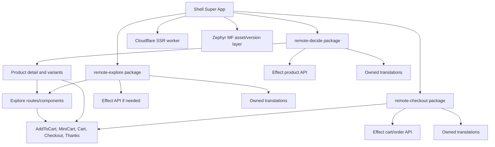

# Module Federation Tractor Implementations Research

Date: 2026-05-28
Subject: Tractor Store implementations that use Module Federation, plus adjacent Native Federation evidence
Confidence: High for repository facts and local code inspection, medium for runtime behavior where the app was not executed locally

## Executive Summary

The strongest direct comparison for UltraModern is the official `module-federation/module-federation-examples` `modernjs-classic-tractor-example`: it proves a Modern.js + Module Federation Tractor split with `explore`, `decide`, and `checkout` remotes. The Zephyr sample proves the same domain split on Rspack + Zephyr, while Florian Rappl's sample proves mixed-bundler interoperability across Rspack, Webpack, and Vite.

Our UltraModern scaffold is ahead on Cloudflare SSR, native Modern.js i18n, strict MF DTS, TypeScript native-preview, Effect BFF ownership, Zephyr bridge wiring, generated contracts, and the first pass of generated commerce boundary UX. It is still behind the Tractor implementations on user-facing domain richness: the demo now labels Explore/Decide/Checkout surfaces in one commerce remote, but it does not yet model them as separate full-stack micro-verticals with real remote-to-remote composition.

## Research Scope

Primary Module Federation implementations:

| Implementation | Repository | Shape | Validation |
| --- | --- | --- | --- |
| Modern.js Classic Tractor | `module-federation/module-federation-examples/modernjs-classic-tractor-example` | Modern.js apps for Explore, Decide, Checkout | Cloned and inspected configs, routes, exposed modules |
| Florian Rappl Tractor v2 | `FlorianRappl/module-federation-tractor-v2` | Mixed Rspack shell, Webpack Explore, Vite Decide, Rspack Checkout | Cloned and inspected MF runtime/configs |
| Kent Li React Tractor | `teabyii/tractor-store-react` | Webpack React remotes, universal-rendering oriented | Cloned and inspected event/cart/boundary code |
| Zephyr Tractor sample | `ZephyrCloudIO/zephyr-examples/module-federation/tractor-sample` | Rspack React remotes with Zephyr deployment plugin | Cloned and inspected Zephyr build scripts/configs |
| Vue Tractor MF | `alexanderop/tractorStoreVueModuleFederation` | Vue 3 host/remotes using MF runtime and fallback loader | Cloned and inspected runtime loader/navigation/cart code |

Adjacent evidence:

| Implementation | Repository | Why included |
| --- | --- | --- |
| Picard Tractor examples | `picardjs/picard` | Native Federation, not Module Federation, but listed by Tractor Store and useful for SSR/native-federation comparison |

## Validated Architecture Patterns

### Canonical Domain Split

The Tractor reference defines three teams:

| Team | Responsibility | Boundary implications |
| --- | --- | --- |
| Explore | Home, product lists, stores, recommendations, header/footer | Header, footer, recommendations, store picker are Explore-owned |
| Decide | Product detail | Product information and variant selection are Decide-owned |
| Checkout | Cart, minicart, add-to-cart, checkout, thanks | Add-to-cart and cart links/buttons are Checkout-owned even when rendered inside a Decide page |

This matters for our demo. A product detail page must visibly nest Checkout and Explore surfaces inside a Decide page. If `Add to cart` is outlined as Decide or the boundary marker changes layout, the demo is teaching the wrong architecture. The current generated commerce page gets the first-order UX right: the page section is marked Decide, the embedded add/view cart controls are marked Checkout, recommendations/header/footer are marked Explore, and the overlay is rendered separately from document flow.

### Modern.js Classic Tractor

The official Module Federation examples repo has a `modernjs-classic-tractor-example` with separate `explore`, `decide`, and `checkout` packages. Each app uses Modern.js, Rspack, `enableAsyncEntry`, and `@module-federation/enhanced/rspack`. The `explore` app exposes `Header`, `Footer`, `Recommendations`, and `StorePicker`; `decide` consumes `checkout/AddToCart` and `explore/*`; `checkout` exposes `MiniCart`, `AddToCart`, cart, and thanks pages.

Important differences from our solution:

| Area | Modern.js Classic Tractor | UltraModern |
| --- | --- | --- |
| Modern.js version | Modern.js 2.54.6 in the inspected example | Modern.js 3/presetUltramodern path |
| Rendering | Modern app routes; example uses classic route integration | Cloudflare streaming SSR with MF app SSR |
| MF types | Example is JS-heavy and not strict DTS-first | DTS is mandatory and validated |
| Backend | Form/server-style checkout fragments, no Effect BFF ownership | Vertical-owned Effect BFF/API contracts |
| i18n | Not a focus | Mandatory native `@modern-js/plugin-i18n` with CDN JSON |

### Zephyr Tractor Sample

The Zephyr repo has `module-federation/tractor-sample`, a React + Rspack + Module Federation sample using `zephyr-rspack-plugin`. Its README documents a Zephyr build order: build Explore, build Checkout, rebuild Explore, build Decide, then build App so Zephyr can map remote relationships. Its configs set `WITH_ZE=true` to wrap Rspack with `withZephyr()`.

Important differences from our solution:

| Area | Zephyr Tractor | UltraModern |
| --- | --- | --- |
| Hosting | Static SPA deployment through Zephyr | Cloudflare SSR worker plus Zephyr asset/version layer |
| DTS | `dts: false` in inspected Rspack MF configs | Strict DTS enabled; `dts: false` forbidden |
| Dependency discovery | Zephyr build order and `withZephyr()` | Generated `zephyr:dependencies` plus Modern.js Rspack bridge |
| Backend | None | Effect BFF in vertical package |

### Florian Rappl Tractor v2

This implementation is valuable because it proves heterogeneous Module Federation: Rspack shell, Webpack Explore, Vite Decide, Rspack Checkout. The host registers remotes at runtime with `@module-federation/enhanced/runtime` and loads exposed modules lazily.

Important difference: it deliberately documents no SSR, hardcoded URLs, no linting/testing/type-safety. That is fine for a cross-bundler demo, but not enough for UltraModern.

### Kent Li React Tractor

Kent's React implementation has the clearest cart/event behavior. Checkout owns an in-memory cart store, listens for `add-to-cart`, `remove-from-cart`, and `clear-cart`, then dispatches `updated-cart`. `AddToCart` and `MiniCart` are Checkout components used across other team surfaces.

This is the pattern our demo should copy structurally, but make safer:

| Pattern | Keep | Improve |
| --- | --- | --- |
| Browser events for cross-team communication | Yes, useful and Tractor-aligned | Wrap in typed helpers or Effect command contracts |
| Checkout-owned cart store | Yes | Add persisted/server-backed Effect BFF option |
| Embedded Checkout controls in Decide page | Yes | Boundary overlay and tests must prove ownership |

### Vue Tractor MF

The Vue implementation adds two useful operational patterns: a shared remote loader with retry/error handling, and runtime navigation events (`mf:navigate`) bridged into the host router. This is a good reference for making remote fallback behavior visible in the UltraModern demo.

## UltraModern Comparison

What our scaffold already does better:

| Capability | Current UltraModern evidence |
| --- | --- |
| Cloudflare SSR | Generated `deploy.target = cloudflare`, worker SSR, streaming SSR |
| Module Federation SSR | `moduleFederationAppSSR: true` and `moduleFederationPlugin()` |
| DTS safety | `displayErrorInTerminal: true`, `compilerInstance: '--package typescript -- tsc'`, validator rejects `dts: false` |
| TypeScript path | TS 6 package for MF DTS compatibility plus TS 7 native-preview for mandatory native checking |
| Native Modern.js i18n | `@modern-js/plugin-i18n`, backend JSON, `reactI18next: false`, locale redirect config |
| Full-stack vertical package | `remote-commerce` owns FE route, MF exposes, Effect BFF API, API client, translations, topology metadata |
| Zephyr integration | Generated `zephyr:dependencies`, `zephyr-rspack-plugin`, flat output config |
| Toolchain policy | pnpm 11 + mise, no Corepack |
| Commerce boundary UX | Generated Explore/Decide/Checkout metadata, user-controlled overlay, non-layout-affecting boundary boxes, and Checkout-owned add/cart controls inside the Decide product section |

Where our demo/implementation is weaker than the Tractor references:

| Gap | Why it matters |
| --- | --- |
| Single commerce remote | Tractor teaches domain ownership through separate Explore/Decide/Checkout remotes; `remote-commerce` labels the split but does not prove independent deployment or runtime composition |
| Boundary visualizer validation | The generated overlay is non-layout-affecting by construction, but the repo still needs browser-level evidence that toggling boundaries preserves scroll height and target bounding boxes |
| Cart behavior depth | The generated demo supports add, quantity increment/decrement, remove, and a cart count; Tractor still expects clear cart, minicart update behavior, checkout, thanks/order confirmation, and cross-team cart events |
| Route richness | Tractor includes home, category, stores, product detail, cart, checkout, thanks; the generated commerce page is still a single localized route with anchored sections |
| Runtime fallback UX | Vue sample has explicit retry/fallback loader patterns; our demo should expose failures clearly |
| Mixed bundler proof | Florian proves MF interop across bundlers; UltraModern should have at least one compatibility validation lane |

## Recommended Improvements

1. Promote the generated commerce demo into a real Tractor reference mode.
   - Use `remote-explore`, `remote-decide`, and `remote-checkout` as full-stack micro-vertical packages.
   - Each vertical owns FE routes/components, MF exposes, translations, Effect API/client where applicable, topology metadata, and deployment/version records.
   - Keep the current single-page boundary visualizer as a local UX aid, but do not treat it as proof of remote ownership.

2. Keep the one-package micro-vertical rule per vertical.
   - Do not split a vertical into disconnected FE and BE packages.
   - A vertical package can expose both React surfaces and Effect-backed APIs.

3. Keep boundary metadata first-class and close the remaining contract gaps.
   - The generated contract now records boundary id, label key, owner, color, and owned surfaces for commerce.
   - Add route/component ownership references and remote package ids so contract consumers can distinguish visual boundary labels from deployable remote boundaries.
   - Continue rendering boundaries through data attributes and CSS variables, not hardcoded selectors only.

4. Validate the boundary visualizer with browser evidence.
   - The generated implementation uses fixed-position overlay boxes, thin strokes, and pointer-events-disabled labels instead of layout-affecting borders.
   - Add Playwright/browser measurements for same scroll height and target bounding boxes before/after toggle.
   - Include mobile and desktop screenshots to prove labels do not cover cart controls or language navigation.

5. Match Tractor ownership exactly.
   - Explore: header, footer, recommendations, store picker, listing surfaces.
   - Decide: product detail and variant choice.
   - Checkout: add-to-cart, view cart/minicart, cart, checkout, thanks, order confirmation.

6. Replace ad hoc browser events with typed domain events.
   - Keep event names compatible with Tractor-style integration.
   - Provide typed helpers for `checkout:add-to-cart`, `checkout:cart-updated`, `checkout:remove-from-cart`, `checkout:clear-cart`, `explore:selected-shop`, and `mf:navigate`.
   - Route side effects through Effect where server state is involved.

7. Add a real checkout vertical.
   - Quantity increments and line-item removal are already visible in the generated single-page demo.
   - Add clear cart, checkout form, store picker integration, thank-you state, minicart update, and deployable Checkout remote ownership.
   - Use local storage for SPA resilience and an Effect BFF path for SSR/server persistence proof.

8. Add remote fallback and version-switch demonstrations.
   - Simulate a remote unavailable state and show a deterministic fallback boundary.
   - Validate Zephyr asset/version switching and Cloudflare SSR behavior separately.

9. Add route-owned localization metadata.
   - Route files should export localized route metadata.
   - The central route map can be generated from route-owned metadata while still allowing manual overrides.

10. Add structural and browser-level validation only.
   - Do not test by searching for source-code strings.
   - Generate the workspace, build it, inspect generated JSON contracts, request SSR routes, and use Playwright/browser tests for behavior and layout.
   - For boundary UX specifically, assert DOM behavior and rendered geometry: boundary toggle visibility, overlay box count, stable action target boxes, stable scroll height, cart count updates, quantity decrement/removal, and mobile label placement.

## Target Architecture

## Validation Notes

Performed:

- Cloned and statically inspected the listed repositories under `/tmp/tractor-mf-research`.
- Verified MF plugin usage, remote names, exposes, shared dependencies, build scripts, boundary data attributes, and cart/event ownership patterns.
- Compared against current UltraModern generator code in `packages/toolkit/create/src/ultramodern-workspace.ts` and scaffold validation in `packages/toolkit/create/template-workspace/scripts/validate-ultramodern-workspace.mjs.handlebars`.
- Re-inspected the generated commerce page after the boundary UX pass: `BoundaryOverlay` collects `[data-boundary]` and `[data-boundary-page]` geometry, renders fixed overlay boxes outside document flow, labels Explore/Decide/Checkout ownership, and leaves Checkout-owned add/view cart controls inside the Decide product detail section.
- Re-inspected generated contract metadata: `boundaryVisualization.mode` is `overlay`, `layoutAffecting` is `false`, the toggle is user-controlled, and Checkout owns `add-to-cart`, `cart-link`, and `cart-lines`.

Not performed:

- I did not run every external Tractor implementation end-to-end locally. Several are demo repositories with different package-manager/runtime assumptions, and the goal here was architectural comparison against our scaffold.
- I did not add source-code-contains tests. The remaining validation recommendation is browser/contract based, not substring based.

## Sources

- Tractor Store official registry and requirements: https://micro-frontends.org/tractor-store/
- Modern.js Classic Tractor in Module Federation examples: https://github.com/module-federation/module-federation-examples/tree/master/modernjs-classic-tractor-example
- Florian Rappl mixed-bundler Module Federation Tractor: https://github.com/FlorianRappl/module-federation-tractor-v2
- Kent Li React Tractor Store: https://github.com/teabyii/tractor-store-react
- Zephyr Tractor sample: https://github.com/ZephyrCloudIO/zephyr-examples/tree/main/module-federation/tractor-sample
- Vue Module Federation Tractor: https://github.com/alexanderop/tractorStoreVueModuleFederation
- Picard Native Federation Tractor examples: https://github.com/picardjs/picard
- UltraModern generator under review: `packages/toolkit/create/src/ultramodern-workspace.ts`
