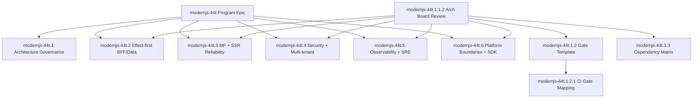

# DEPENDENCY-0001: Parallel Lane and Blocker Matrix

- Status: Active
- Date: 2026-02-22
- Related Beads: `modernjs-44t.1.3`
- Source of truth: Beads dependency graph (`modernjs-44t*`)

## 1. Objective

Define what can run in parallel vs what is blocked, so execution can maximize throughput while preserving correctness.

## 2. Root Program Graph

## 3. Parallelization Rules

## Rule Set

1. Any ticket with dependency `blocks: modernjs-44t.1.1.2` may start only after architecture board completion.
2. Parent-child relationships do not force strict serial execution among siblings unless explicit `blocks` edges exist.
3. Security-sensitive tickets (`modernjs-44t.4.*`) that define shared contracts should complete before dependent lanes consume those contracts.
4. Release-governance tickets (`modernjs-44t.5.4`, `modernjs-44t.5.5`) are terminal-stage gates and should run after upstream reliability/security contract tickets.

## Critical Dependency -> Gate Mapping

| Ticket | Blocking Dependencies | Required Gate Completion Before Start | Stream Owner |
| --- | --- | --- | --- |
| `modernjs-44t.2.5` | `modernjs-44t.2.2`, `modernjs-44t.2.4` | Gate B + C on blockers, Gate A for API contract scope | Stream A (BFF/Data) |
| `modernjs-44t.3.5` | `modernjs-44t.3.1`, `modernjs-44t.3.2`, `modernjs-44t.3.4` | Gate B + C on all blockers, Gate D on MF reliability findings | Stream B (MF/SSR) |
| `modernjs-44t.4.5` | `modernjs-44t.4.2` | Gate B + C on policy middleware, Gate D for trust-boundary findings | Stream C (Security) |
| `modernjs-44t.5.4` | `modernjs-44t.5.2`, `modernjs-44t.2.5`, `modernjs-44t.3.5` | Gate C test evidence for SLO/canary dependencies + Gate D review closure | Stream D (Observability/SRE) |
| `modernjs-44t.5.5` | `modernjs-44t.2.5`, `modernjs-44t.3.5`, `modernjs-44t.4.5` | Gate C and D evidence on each upstream contract stream | Stream D (Observability/SRE) |
| `modernjs-44t.6.4` | `modernjs-44t.6.2`, `modernjs-44t.6.3`, `modernjs-44t.5.5` | Gate B/C for SDK and anti-pattern checks + Gate D for certification closure | Stream E (Platform/SDK) |

No downstream wave may begin if any row above is missing required gate evidence in ticket comments/docs.

Evidence completion ownership:

1. Ticket owner publishes gate artifacts.
2. Stream gate steward validates required gates before marking dependency row complete.
3. CI gate checks from `modernjs-44t.1.2.1` provide objective signal for gate completion status.
4. Release coordinator verifies all dependency rows are complete before wave promotion.

## 4. Execution Waves

## Wave 0 (Completed Blockers)

1. `modernjs-44t.1.1`
2. `modernjs-44t.1.1.1`
3. `modernjs-44t.1.1.2`

## Wave 1 (Governance Foundation; parallel)

1. `modernjs-44t.1.2` (gate template)
2. `modernjs-44t.1.3` (dependency matrix)

## Wave 2 (Policy and contract roots; parallel where possible)

1. `modernjs-44t.2.1`, `modernjs-44t.2.2`, `modernjs-44t.2.4`
2. `modernjs-44t.3.1`, `modernjs-44t.3.2`
3. `modernjs-44t.4.1`
4. `modernjs-44t.5.1`
5. `modernjs-44t.6.1`

## Wave 3 (Dependent hardening tracks; mixed)

1. `modernjs-44t.2.2.1`, `modernjs-44t.2.2.2`, `modernjs-44t.2.3`, `modernjs-44t.2.5`
2. `modernjs-44t.3.1.1`, `modernjs-44t.3.2.1`, `modernjs-44t.3.3`, `modernjs-44t.3.4`
3. `modernjs-44t.4.2`, `modernjs-44t.4.3`, `modernjs-44t.4.4`, `modernjs-44t.4.5`
4. `modernjs-44t.5.2`, `modernjs-44t.5.3`
5. `modernjs-44t.6.2`, `modernjs-44t.6.3`

## Wave 4 (Terminal verification and release gates; mostly sequential)

1. `modernjs-44t.3.5` depends on `3.1 + 3.2 + 3.4`
2. `modernjs-44t.5.4` depends on `5.2 + 2.5 + 3.5`
3. `modernjs-44t.5.5` depends on `2.5 + 3.5 + 4.5`
4. `modernjs-44t.6.4` depends on `6.2 + 6.3 + 5.5`

## 5. Critical Blockers (High Leverage)

1. `modernjs-44t.2.5` blocks release gate pipeline and canary orchestration.
2. `modernjs-44t.3.5` blocks canary/rollback and release candidate contract validation.
3. `modernjs-44t.4.5` blocks final release-candidate gate pipeline.
4. `modernjs-44t.6.1` blocks module SDK contracts and anti-pattern CI checks.

## 6. Recommended Concurrency Plan

Maximize throughput with independent streams after Wave 1:

1. Stream A: `2.*` Effect-first BFF/data.
2. Stream B: `3.*` MF/SSR reliability.
3. Stream C: `4.*` Security trust boundaries.
4. Stream D: `5.*` Observability + release governance.
5. Stream E: `6.*` Platform boundaries + SDK.

Constraints:

1. Stream D terminal tickets (`5.4`, `5.5`) wait for outputs from A/B/C.
2. Stream E terminal ticket (`6.4`) waits for `5.5` and E middle tickets.

## 7. Exit Criteria For DEPENDENCY-0001

1. Matrix explicitly lists parallel and sequential segments.
2. Critical blockers are identified and tied to downstream impact.
3. Document is linked from RFC/ADR index and used as planning reference for execution.
4. Scheduling rules are explicitly bound to `GATES-0001` evidence model (A-D), not only dependency edges.
